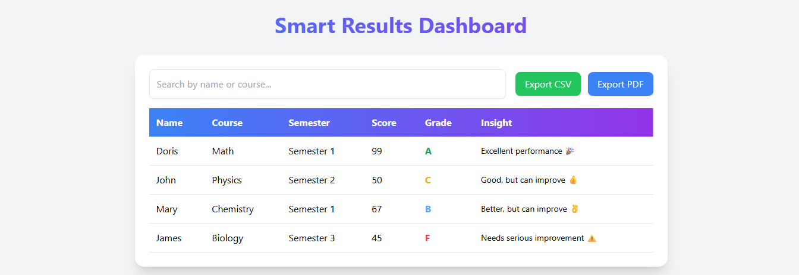
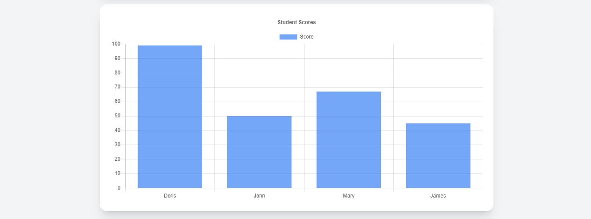

# 🎓 Smart Results Viewer

## 🔗 Live Demo
 [Live Demo](https://smart-results-viewer.netlify.app/)
 [Live Demo](https://smart-results-viewer-seven.vercel.app/)

---

## 📌 Project Overview
Smart Results Viewer is a web application that allows users to view and analyze results in a clean, interactive, and user-friendly interface. It presents data visually and makes it easier to understand performance at a glance.

---

## ✨ Features
- 📊 Interactive data visualization (charts)
- 🔍 Clear and structured results display
- 📱 Fully responsive design (works on all screen sizes)
- ⚡ Fast performance using Vite
- 🎨 Clean and modern UI

---

## 🛠️ Technologies Used
- React
- Vite
- Tailwind CSS
- Chart.js
- Axios

---

## 📸 Screenshots

### Dashboard

### 📊 Score-Chart

---

## 📊 Presentation Slides
 [Presentation Slides](https://1drv.ms/p/c/bd65402bfdcd81e8/IQAupSn9kZrUTppcClst7ccyAc43ImE0GG1-Kn2NSa6k73Q?e=gHLErc)
---

## 🎨 Color Palette
 [Color Palette](https://coolors.co/f3f4f6-8b5cf6-16a34a-60a5fa-2563eb-22c55e-3b82f6-6b7280)
